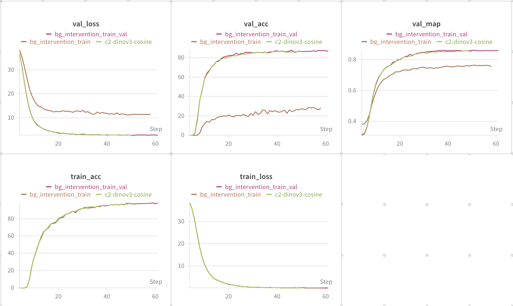

# EDA Experiments

## Loss Function Comparison

The baseline notebook provided adds a ArcFace Layer to the classification head that normalizes embeddings and is used in combination with Cross Entropy to compute the loss for training. I want to find out if this is necessary or can be replaced with a different loss function. Namely Cross Entropy (CE) or Focal loss.
Cross Entropy is one of the simplest and loss functions and works generally well on most tasks. Focal loss works especially well on imbalanced datasets, which the jaguar-ident is.

### Test Setup

Because CE and Focal loss are computed on logits not embeddings, I replaced the ArcFace Layer with a linear layer. This produces the logits required to apply the loss function.

Compare different metric learning and classification losses:

| Loss              | Applied to | Head type         |
| ----------------- | ---------- | ----------------- |
| **ArcFace**       | Embeddings | ArcFaceLayer      |
| **Cross Entropy** | Logits     | Linear classifier |
| **Focal**         | Logits     | Linear classifier |

The following model configuration has been used for the comparison:

backbone: BVRA/MegaDescriptor-L-384
LR-scheduler: reduce on plateau
base LR: 1e-4
optimizer: AdamW
weight decay: 1e-4

Config Files
[ArcFace baseline](configs/baseline.json), [Cross Entropy](configs/loss-ce.json), [Focal](configs/loss-focal.json)

### Run Comparison

| WandB Run                                                                              | best val MAP |
| -------------------------------------------------------------------------------------- | ------------ |
| [ArcFace baseline](https://wandb.ai/linus-loell/jaguar-reid-linus-loell/runs/47zq6bkj) | 0.7723       |
| [Cross Entropy](https://wandb.ai/linus-loell/jaguar-reid-linus-loell/runs/9qyuebig)    | 0.7363       |
| [Focal](https://wandb.ai/linus-loell/jaguar-reid-linus-loell/runs/907nhx4l)            | 0.5459       |

- Ranking by best val mAP: ArcFace > CE > Focal > Sphere.
- ArcFace shows the most stable and strongest retrieval performance in this controlled setup.

## Background Variation

In the provided images there may be other information encoded apart from the appearance of the jaguar. The background could provide locational or temporal clues that help with identification.

### Test Setup

To examine the extend of these effects I removed the background from the train and validation sets. Next I used the best performing model architecture and compared three scenarios:

1. Train and validate on images with background
2. Train without background, validate on complete images
3. Train and validate on images without background

In all cases where the background was removed, I used the provided alpha masks to replace all non-jaguar pixels with random noise.

The following configuration was used for training:

backbone: facebook/dinov3-vitl16-pretrain-lvd1689m
loss function: ArcFace
batch size: 32
LR: 3e-4
LR-Scheduler: Cosine Annealing with warmup
Optimizer: AdamW
seed: 42

The specific configuration files for each run are:
[No intervention baseline](configs/dinov3-cosine.json), [Noise in train only](configs/bg_intervention_train.json), [Noise in train and val](configs/bg_intervention_train_val.json).

### Run Comparison

Intervention definition used in these runs:

- `none`: no background modification.
- `noise`: replace non-jaguar pixels with random noise.

| WandB Run                                                                                                      | Train BG Intervention | Val BG Intervention | Best Val MAP | Min Val Loss |
| -------------------------------------------------------------------------------------------------------------- | --------------------- | ------------------- | ------------ | ------------ |
| [No intervention baseline (dinov3-cosine)](https://wandb.ai/linus-loell/jaguar-reid-linus-loell/runs/6b3ju9n1) | none                  | none                | 0.9066       | 1.8889       |
| [Noise in train only](https://wandb.ai/linus-loell/jaguar-reid-linus-loell/runs/87w4esrb)                      | noise                 | none                | 0.7621       | 11.1889      |
| [Noise in train and val](https://wandb.ai/linus-loell/jaguar-reid-linus-loell/runs/cbz8xei0)                   | noise                 | noise               | 0.8619       | 2.7303       |

- Delta vs baseline (train-only noise): -0.1445 best val mAP
- Delta vs baseline (train+val noise): -0.0447 best val mAP

### Conclusion

- Interpretation: both noise interventions underperform the no-intervention baseline, with train-only noise causing a much larger drop.
