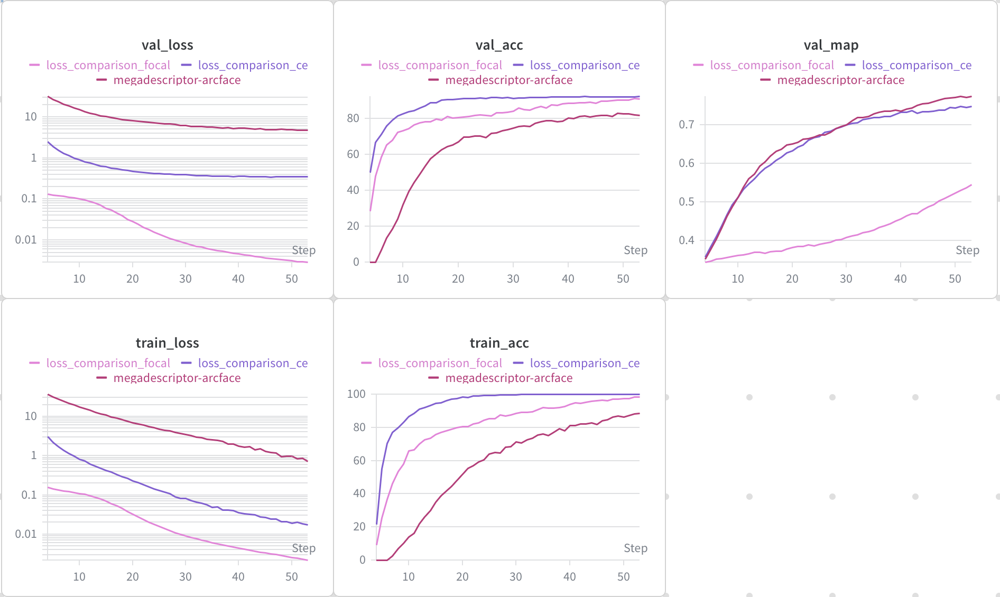

# EDA Experiments

## Loss Function Comparison

The baseline notebook provided adds a ArcFace Layer to the classification head that normalizes embeddings and is used in combination with Cross Entropy to compute the loss for training. I want to find out if this is necessary or can be replaced with a different loss function. Namely Cross Entropy (CE) or Focal loss.
Cross Entropy is one of the simplest and loss functions and works generally well on most tasks. Focal loss works especially well on imbalanced datasets, which the jaguar-ident is.

### Test Setup

Because CE and Focal loss are computed on logits not embeddings, I replaced the ArcFace Layer with a linear layer. This produces the logits required to apply the loss function.

Compare different metric learning and classification losses:

| Loss              | Applied to | Head type         |
| ----------------- | ---------- | ----------------- |
| **ArcFace**       | Embeddings | ArcFaceLayer      |
| **Cross Entropy** | Logits     | Linear classifier |
| **Focal**         | Logits     | Linear classifier |

The following model configuration has been used for the comparison:

backbone: BVRA/MegaDescriptor-L-384
LR-scheduler: reduce on plateau
base LR: 1e-4
optimizer: AdamW
weight decay: 1e-4

Config Files
[ArcFace baseline](configs/baseline.json), [Cross Entropy](configs/loss-ce.json), [Focal](configs/loss-focal.json)

### Run Comparison

| WandB Run                                                                              | MAP    |
| -------------------------------------------------------------------------------------- | ------ |
| [ArcFace baseline](https://wandb.ai/linus-loell/jaguar-reid-linus-loell/runs/47zq6bkj) | 0.7743 |
| [Cross Entropy](https://wandb.ai/linus-loell/jaguar-reid-linus-loell/runs/9qyuebig)    | 0.7480 |
| [Focal](https://wandb.ai/linus-loell/jaguar-reid-linus-loell/runs/907nhx4l)            | 0.5459 |

- Ranking by mAP: ArcFace > CE > Focal > Sphere.
- ArcFace shows the most stable and strongest retrieval performance in this controlled setup.

## Background Variation

Q26: I measured the performance drop of my top-performing model when including background information vs disregarding it. Does this count as a valid experiment?
Ruling: 1.0 (Valid experiment)
Where to document this: EDA_EXPERIMENTS.md (cross-reference in LEADERBOARD_EXPERIMENTS.md if it is part of your final submission report)
Rationale: Yes. This is a critical analysis of whether the top-performing model relies on background cues rather than identity cues. It tests robustness and helps interpret improvements on the leaderboard.
Bonus: Any experiment entry that includes this comparison receives a +0.5 bonus, applied once per experiment entry.
What to document:
The exact top-performing configuration (model, loss, training protocol, validation protocol)
The background intervention definition (use of included alpha mask or other methods like custom segmentation, gray replacement, random replacement, synthetic background, etc.)
Identity-balanced mAP with background included vs background disregarded
The mAP delta (performance drop) and a short interpretation of what the drop suggests about context reliance

### Run Comparison

Intervention definition used in these runs:

- `none`: no background modification.
- `noise`: replace non-jaguar pixels with random noise.

The specific configuration files for each run are:
[No intervention baseline](configs/dinov3-cosine.json), [Noise in train only](configs/bg_intervention_train.json), [Noise in train and val](configs/bg_intervention_train_val.json).

| WandB Run                                                                                                      | Train BG Intervention | Val BG Intervention | Optimizer | LR Scheduler  | Seed | MAP    | Min Val Loss |
| -------------------------------------------------------------------------------------------------------------- | --------------------- | ------------------- | --------- | ------------- | ---- | ------ | ------------ |
| [No intervention baseline (dinov3-cosine)](https://wandb.ai/linus-loell/jaguar-reid-linus-loell/runs/6b3ju9n1) | none                  | none                | adamw     | cosine_warmup | 42   | 0.8994 | 1.8889       |
| [Noise in train only](https://wandb.ai/linus-loell/jaguar-reid-linus-loell/runs/87w4esrb)                      | noise                 | none                | adamw     | cosine_warmup | 42   | 0.7569 | 11.1889      |
| [Noise in train and val](https://wandb.ai/linus-loell/jaguar-reid-linus-loell/runs/cbz8xei0)                   | noise                 | noise               | adamw     | cosine_warmup | 42   | 0.8610 | 2.7303       |

- Delta vs baseline (train-only noise): -0.1426 mAP
- Delta vs baseline (train+val noise): -0.0385 mAP
- Interpretation: both noise interventions underperform the no-intervention baseline, with train-only noise causing a much larger drop.
