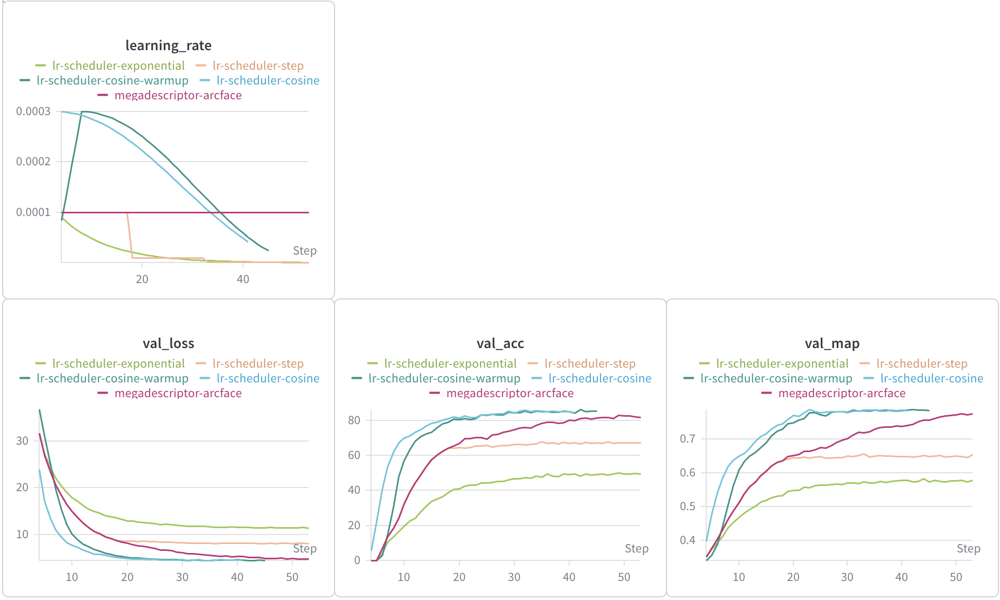
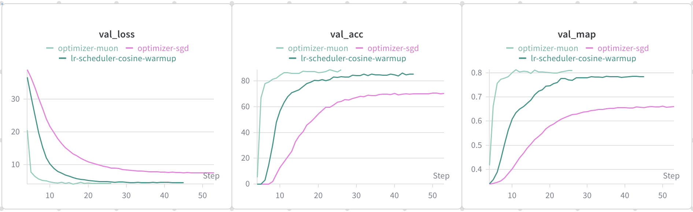
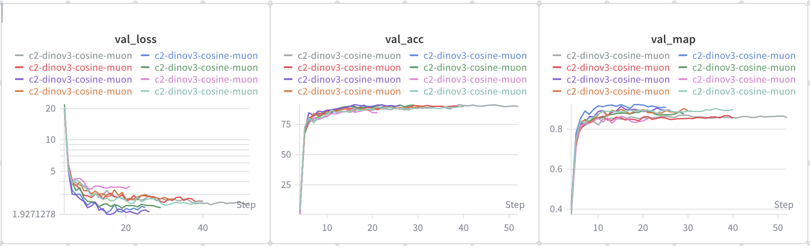

# Leaderboard Experiments

WandB Project: [https://wandb.ai/linus-loell/jaguar-reid-linus-loell/]

## Requirements

## 1. Backbone Comparison

One of the first experiments I did, was using different backbone models to compute the embeddings used as input for the classification head. The classification head relies completely on the information encoded in the embeddings. Therefore using a backbone model that extracts more relevant information should improve the overall performance drastically.

### Backbones

I chose 6 different backbones to compare. All of them where pretrained on large datasets. The models differ in their size and architecture.

**1. MegaDescriptor:**
A large transformer model of 195,198,516 parameters based on Swin-Transformer architecture. This model was trained on wildlife images, to facilitate the identification of animals. Because this is the only model in the comparison that was trained for the purpose of this challenge, I expect it to perform very well.

**2. SwinTransformer**
A transformer model with 27,519,354 parameters. Because MegaDescriptor is based on SwinTransformer model it will be interesting to compare what effect the training on domain images has, compared to the general training of SwinTransformer.
I accidentally used the tiny version with only ~30.000.000 parameters instead of the large version that MegaDescriptor is based on, so the results may be influenced by the smaller parameter count.

**3. DinoV3**
DinoV3 is a vision transformer model introduced in 2025 and considered state of the art for many computer vision tasks. It is also the largest model in this comparison with 303,129,600 parameters. Because the model implements Rotary Position Embeddings, we are able to input images with a resolution of up to 4096×4096 pixel. This might improve the detection of smaller patterns and and therefore improve classification performance.

**4. ConvNext v2**
ConvNextV2 is a convolutional neural network with 27,866,496 parameters. The goal is to compare how a traditional CNN can compare against transformer architectures.

**5. EfficientNet**
Efficient net is a CNN model with 63,786,960 parameters. This model was included to see the effect of parameters size on model performance. It resides somewhere between small models with less than 30,000,000 parameters and the large models with 200,000,000+ parameters.

**6. ResNet18**
ResNet is the smallest model in the comparison. It is a CNN with only 11,176,512 parameters. The small parameter count should also make it the most efficient model in the lineup.

### Test Setup

For all models a uniform testing setup was used:

- loss function: ArcFace
- LR-scheduler: reduce on plateau
- base LR: 1e-4
- optimizer: AdamW
- weight decay: 1e-4

The specific configuration files for each run are:
[MegaDescriptor](configs/baseline.json), [DINOv3](configs/dinov3.json), [ConvNeXt v2](configs/convnextv2.json), [SwinTransformer](configs/swintransformer.json), [EfficientNet](configs/efficientnet.json), [ResNet18](configs/resnet18.json).

### Results

| WandB Run                                                                              | HF Path                                  | Parameters  | Backbone Embedding Dim | Best Val MAP | Min Val Loss |
| -------------------------------------------------------------------------------------- | ---------------------------------------- | ----------- | ---------------------- | ------------ | ------------ |
| [Megadescriptor](https://wandb.ai/linus-loell/jaguar-reid-linus-loell/runs/47zq6bkj)   | BVRA/MegaDescriptor-L-384                | 195,198,516 | 1536                   | 0.7723       | 4.7830       |
| [DINOv3](https://wandb.ai/linus-loell/jaguar-reid-linus-loell/runs/7hnwafmx)           | facebook/dinov3-vitl16-pretrain-lvd1689m | 303,129,600 | 1024                   | 0.8923       | 2.2992       |
| [ConvNeXt v2](https://wandb.ai/linus-loell/jaguar-reid-linus-loell/runs/48uwne32)      | facebook/convnextv2-tiny-22k-224         | 27,866,496  | 768                    | 0.7302       | 5.9024       |
| [Swin Transformer](https://wandb.ai/linus-loell/jaguar-reid-linus-loell/runs/f5fv3fff) | microsoft/swin-tiny-patch4-window7-224   | 27,519,354  | 768                    | 0.7507       | 5.4399       |
| [EfficientNet](https://wandb.ai/linus-loell/jaguar-reid-linus-loell/runs/0byg06qo)     | google/efficientnet-b7                   | 63,786,960  | 2560                   | 0.8329       | 3.5640       |
| [ResNet18](https://wandb.ai/linus-loell/jaguar-reid-linus-loell/runs/b8ou0tqc)         | microsoft/resnet-18                      | 11,176,512  | 512                    | 0.6531       | 8.3584       |

### Conclusion

There are two clear winners emerging from this comparison. DINOv3 has by far the best mAP score of 0.8932, even outperforming the domain model MegaDescriptor by 15,54%. On the other hand there EfficientNet also surpassed MegaDescriptor by 7,85% with a mAP of 0.8329 while having only a third of the parameters.

Looking at the relationship between parameters, embedding size and mAP it seems to suggest that both have a positive influence on classification performance.
Most likely can larger models provide denser embeddings and larger embeddings can retain more information. Which both should help with classification.

Because the goal of the challenge is to develop the best performing model I will use DINOv3 embeddings for the challenge.
But for a possible deployment the efficiency of EfficientNet should be kept in consideration.

## 2. Learning Rate Scheduler Comparison

When training the classification head, choosing the right Learning Rate Scheduler can help stabilize training and avoid local minimums.
I decided to compare the reduce on plateau scheduler from the baseline notebook with 3 other common schedulers: Cosine Annealing, Step Decay and Exponential.
Because the model uses ArcFace loss, which includes learnable parameters, I decided to also add a version of Cosine Annealing with a warmup period. For the first 5 epochs the learning rate (LR) is increased linear to stabilize the training. after Epoch 5 a Cosine Annealing Scheduler is used.

### Test Setup

For all models a uniform testing setup was used:

- backbone model: hf-hub:BVRA/MegaDescriptor-L-384
- loss function: ArcFace
- optimizer: AdamW
- batch size: 32
- epochs: 50
- weight decay: 1e-4
- seed: 42
- baseline scheduler config: reduce_on_plateau with factor=0.5, patience=5

I decided to increase the starting LR rate for the Cosine Annealing scheduler to 3e-4 (from 1e-4), because the LR drops quickly after a few epochs. In retrospect do I believe that I should have tested 2 runs per scheduler. One with each LR.

The specific configuration files for each run are:
[Reduce on Plateau](configs/baseline.json), [Cosine](configs/lr-scheduler-cosine.json), [Cosine Warmup](configs/lr-scheduler-cosine-warmup.json), [Step Decay](configs/lr-scheduler-step.json), [Exponential](configs/lr-scheduler-exponential.json).

### Results

| WandB Run                                                                                          | LR Scheduler      | Scheduler Hyperparameters                                        | Base LR | Best Epoch | Best Val MAP | Min Val Loss |
| -------------------------------------------------------------------------------------------------- | ----------------- | ---------------------------------------------------------------- | ------- | ---------- | ------------ | ------------ |
| [Reduce on Plateau (baseline)](https://wandb.ai/linus-loell/jaguar-reid-linus-loell/runs/47zq6bkj) | reduce_on_plateau | mode=min, factor=0.5, patience=5                                 | 1e-4    | 49         | 0.7723       | 4.7830       |
| [Cosine Annealing](https://wandb.ai/linus-loell/jaguar-reid-linus-loell/runs/n9tm0w3h)             | cosine            | T_max=50, eta_min=1e-6                                           | 3e-4    | 28         | 0.7820       | 4.4786       |
| [Cosine Annealing with Warmup](https://wandb.ai/linus-loell/jaguar-reid-linus-loell/runs/keclfwbf) | cosine_warmup     | warmup_epochs=5, warmup_start_factor=0.1, T_max=45, eta_min=1e-6 | 3e-4    | 32         | 0.7860       | 4.4752       |
| [Step Decay](https://wandb.ai/linus-loell/jaguar-reid-linus-loell/runs/3b9l1w0e)                   | step              | step_size=15, gamma=0.1                                          | 1e-4    | 50         | 0.6549       | 8.1010       |
| [Exponential](https://wandb.ai/linus-loell/jaguar-reid-linus-loell/runs/w5uhwgyo)                  | exponential       | gamma=0.9                                                        | 1e-4    | 50         | 0.5786       | 11.4150      |

### Conclusion

The cosine annealing approach only slightly improves on the baseline with a mAP of 0.7860 (+1.77%) with warmup and mAP of 0.7820 (+1.26%) without. Looking at the loss and accuracy curves can give us some more insight. Here we can see, that both variants converge much faster compared to the baseline. So that they reach there best mAP already after 32 (28 without warmup) epochs.

Compared to that step decay and exponential decay both underperform heavily (0.6549 and 0.5786 mAP), indicating either these schedulers are not a good fit for the scenario, or the hyperparameter need to be adjusted further. The next step should therefore be to do a sweep over different learning rates for each scheduler.

I will be using Cosine Annealing with a 5 epoch warmup for my combined best approach.

## 3. Optimizer comparison

Using the best performing LR-Scheduler from the previous experiment (Cosine Annealing with warmup) I wanted to improve training performance further by testing different optimizers.
I decided to use the previous run with AdamW as a baseline and compare it to Stochastic Gradient Decent (SDG) and Momentum Orthogonalized Neighbor (Muon).
Because Muon is not designed for embedding and output layers, the last two layers (p.ndim < 2) where optimized using AdamW.

### Test Setup

- backbone model: `hf-hub:BVRA/MegaDescriptor-L-384`
- loss function: ArcFace
- LR scheduler: cosine annealing with warmup
- warmup epochs: 5
- base LR: 3e-4
- batch size: 32
- epochs: 50
- train/val split: 0.8 / 0.2
- seed: 42

The specific configuration files for each run are:
[AdamW baseline](configs/lr-scheduler-cosine-warmup.json), [Muon](configs/optimizer-muon.json), [SGD](configs/optimizer-sgd.json).

### Results

| WandB Run                                                                            | LR Scheduler  | Seed | Best mAP Epoch | Best Val MAP | Min Val Loss |
| ------------------------------------------------------------------------------------ | ------------- | ---- | -------------- | ------------ | ------------ |
| [AdamW baseline](https://wandb.ai/linus-loell/jaguar-reid-linus-loell/runs/keclfwbf) | cosine_warmup | 42   | 32             | 0.7860       | 4.4752       |
| [Muon](https://wandb.ai/linus-loell/jaguar-reid-linus-loell/runs/yq7zon1d)           | cosine_warmup | 42   | 13             | 0.8117       | 4.0503       |
| [SGD](https://wandb.ai/linus-loell/jaguar-reid-linus-loell/runs/ambrikzt)            | cosine_warmup | 42   | 50             | 0.6608       | 7.4874       |

### Conclusion

It is clear that SGD performs worst out of all three options, being outperformed by both muon and the baseline.
With a mAP of 0.8117 Muon not only improves on AdamW baseline by +3.3% it also reaches this level much faster during traing.

For this task Muon is clearly the best option, offering best model performance and fast training, and will be used in the final model configuration.

## 4. Validation of best experiment over multiple random seeds

After experimentation, the best performing model configuration for the second Kaggle challenge used a DinoV3 backend, ArcFace as a loss function, Cosine Annealing with warmup as LR-scheduler, and muon as an optimizer. To validate the stability of the model I trained it 8 times using different seeds.

### Setup

The model was always configured the same:

- backbone model: `facebook/dinov3-vitl16-pretrain-lvd1689m`
- optimizer: muon
- LR scheduler: cosine_warmup
- loss function: ArcFace

The repeated runs all use the same configuration file:
[c2-dinov3-cosine-muon](configs/c2-dinov3-cosine-muon.json), but had a different seeds set using an environment variable.

### Results (8 seeds)

| WandB Run                                                                     | Seed | Best Val MAP | Min Val Loss |
| ----------------------------------------------------------------------------- | ---- | ------------ | ------------ |
| [seed 42](https://wandb.ai/linus-loell/jaguar-reid-linus-loell/runs/e7lxwr6h) | 42   | 0.8646       | 2.3953       |
| [seed 43](https://wandb.ai/linus-loell/jaguar-reid-linus-loell/runs/ccwjpasy) | 43   | 0.9234       | 2.0080       |
| [seed 44](https://wandb.ai/linus-loell/jaguar-reid-linus-loell/runs/yi8yjzrf) | 44   | 0.8547       | 2.5414       |
| [seed 45](https://wandb.ai/linus-loell/jaguar-reid-linus-loell/runs/3it20ttu) | 45   | 0.8858       | 2.2253       |
| [seed 46](https://wandb.ai/linus-loell/jaguar-reid-linus-loell/runs/ok25h1d3) | 46   | 0.9002       | 1.9271       |
| [seed 47](https://wandb.ai/linus-loell/jaguar-reid-linus-loell/runs/rl3rqevm) | 47   | 0.8358       | 3.4035       |
| [seed 48](https://wandb.ai/linus-loell/jaguar-reid-linus-loell/runs/ktmsa0o1) | 48   | 0.8821       | 2.6978       |
| [seed 49](https://wandb.ai/linus-loell/jaguar-reid-linus-loell/runs/utjb3ain) | 49   | 0.8918       | 2.3680       |

### Conclusion

Across 8 seeds, the mean validation mAP is 0.8798 with a standard deviation of 0.025. The values for mAP range from 0.8358 to 0.9234.

This confirms the configuration to be consistently strong for the challenge. Although a change of the seed can still alter the model performance moderately. With a std of 0.025 this could be an indicator for instability in the training process.

When assembling the model configuration, some configuration option where abandoned even though their performance was well within a mAP of +/- 0.025. It is therefore possible that a different configuration could provide better results, but was not considered because their performance was due to random factors worse than the final model choice.
