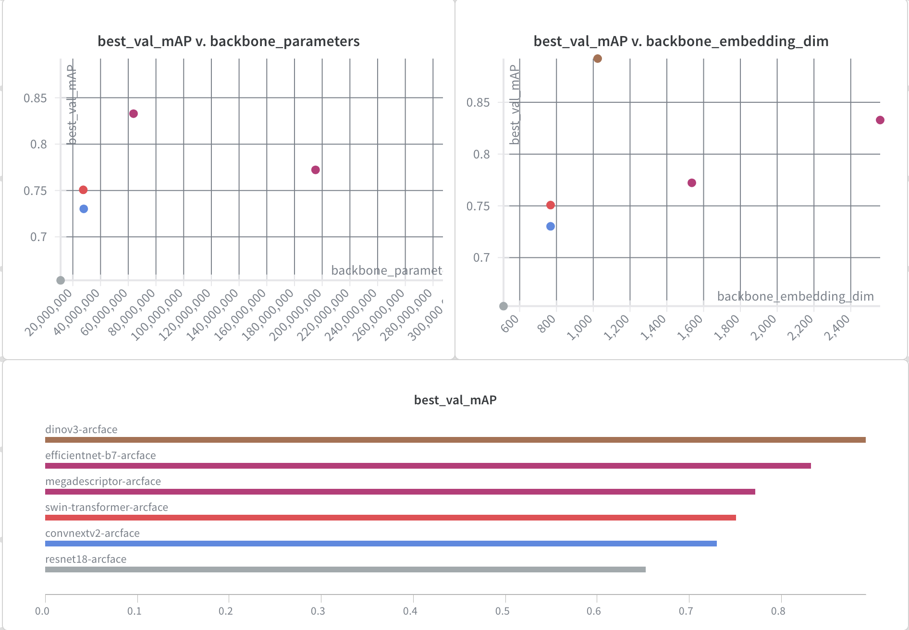
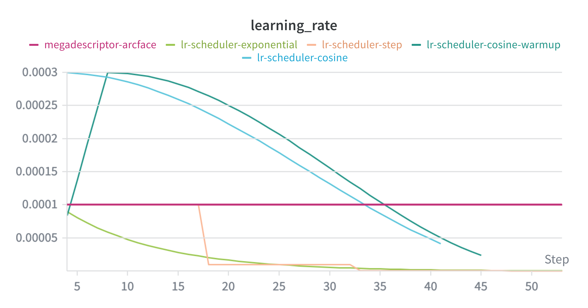

# Leaderboard Experiments

WandB Project: [https://wandb.ai/linus-loell/jaguar-reid-linus-loell/]

## Requirements

**Q5:** I compared multiple backbones (for example, ResNet18 vs DINOv3 vs EfficientNet vs MegaDescriptor). How is this scored?
Ruling: One experiment. Score depends on control and analysis, plus backbone-count bonus.
Where to document this: LEADERBOARD_EXPERIMENTS.md (optional deeper diagnostics in EDA with cross-reference)

Base requirements:
Same training protocol, loss, schedule, augmentation, evaluation
Same embedding dimension (or justification)
Report mAP and at least one efficiency metric

Scoring for backbone comparison:
Base score: 1.0 if Valid criteria are met
Bonus: +0.20 per backbone included in the controlled comparison
2 backbones: 1.20
3 backbones: 1.40
4 backbones: 1.60
5 or more backbones: 2.00 (cap)

What to document:
Why these backbones
Table: mAP and efficiency metrics
Interpretation: what characteristics matter and why

**Q23:** I compared different optimizers (Adam, AdamW, Muon, SGD with momentum) and learning rate schedulers (cosine annealing, one cycle policy, reduce-on-plateau). Does this count as a valid experiment?
Ruling: 1.0 (Valid experiment)

Where to document this:
If the goal is understanding training stability and sensitivity: EDA_EXPERIMENTS.md
If the goal is improving the public leaderboard and it changes the final pipeline: LEADERBOARD_EXPERIMENTS.md
Choose one as primary and cross-reference the other if needed.
Rationale: Yes. Optimizer choice and learning rate scheduling are core training design decisions. A controlled comparison answers a clear research question, such as “Which optimizer or scheduler yields the best identity-balanced mAP and stability for this dataset and model?”

How to count experiments:
Comparing multiple optimizers under one fixed scheduler is one experiment (“Which optimizer works best?”).
Comparing multiple schedulers under one fixed optimizer is one experiment (“Which scheduler works best?”).
Comparing optimizer–scheduler pairs as a grid is one experiment if framed as one question (“Which combination works best?”), but it must be documented as a structured study, not ad hoc tuning.

Validity requirements (minimum):
Controlled setup: same backbone, loss, augmentations, batch size, embedding dimension, training length, and evaluation protocol
Clear definitions: optimizer hyperparameters (weight decay, betas, momentum) and scheduler settings (warmup, max LR, cycle length, patience)

Report identity-balanced mAP plus training stability indicators (divergence rate, variance across seeds, convergence curves)
What to document:
The comparison plan (which optimizers, which schedulers, and why)

A results table with identity-balanced mAP for each condition
Training dynamics: convergence speed, stability, and sensitivity
Mean and standard deviation across seeds for top contenders
Interpretation: why the best choice fits this task (regularization, noisy gradients, batch size effects)

**Q22:** I ran my best experiment according to mAP five to ten times with different random seeds. Does this count as a valid experiment?
Ruling: 1.0 (Valid experiment)
Where to document this: LEADERBOARD_EXPERIMENTS.md (cross-reference in EDA_EXPERIMENTS.md if you include a variance or stability discussion)
Rationale: Yes. Running the same configuration across five to ten random seeds increases the significance of the result and reduces the chance of reporting a lucky run.
What to document:
The exact configuration being repeated (model, loss, training schedule, augmentation, validation protocol)
The list of random seeds used
Identity-balanced mAP for each seed
Mean and standard deviation of identity-balanced mAP across seeds
Interpretation:
If the standard deviation is small, the result supports the claim of improvement
If the standard deviation is large, the result indicates instability and limits the strength of the claim
Add this as Q23, and renumber the current Edge cases question from Q23 → Q24.

## 1. Backbone comparison

One of the first experiments I did, was using different backbone models to compute the embeddings used as input for the classification head. The classification head relies completely on the information encoded in the embeddings. Therefore using a backbone model that extracts more relevant information should improve the overall performance drastically.

### Backbones

I chose 6 different backbones to compare. All of them where pretrained on large datasets. The models differ in their size and architecture.

**1. MegaDescriptor:**
A large transformer model of 195,198,516 parameters based on Swin-Transformer architecture. This model was trained on wildlife images, to facilitate the identification of animals. Because this is the only model in the comparison that was trained for the purpose of this challenge, I expect it to perform very well.

**2. SwinTransformer**
A transformer model with 27,519,354 parameters. Because MegaDescriptor is based on SwinTransformer model it will be interesting to compare what effect the training on domain images has, compared to the general training of SwinTransformer.
I accidentally used the tiny version with only ~30.000.000 parameters instead of the large version that MegaDescriptor is based on, so the results may be influenced by the smaller parameter count.

**3. DinoV3**
DinoV3 is a vision transformer model introduced in 2025 and considered state of the art for many computer vision tasks. It is also the largest model in this comparison with 303,129,600 parameters. Because the model implements Rotary Position Embeddings, we are able to input images with a resolution of up to 4096×4096 pixel. This might improve the detection of smaller patterns and and therefore improve classification performance.

**4. ConvNext v2**
ConvNextV2 is a convolutional neural network with 27,866,496 parameters. The goal is to compare how a traditional CNN can compare against transformer architectures.

**5. EfficientNet**
Efficient net is a CNN model with 63,786,960 parameters. This model was included to see the effect of parameters size on model performance. It resides somewhere between small models with less than 30,000,000 parameters and the large models with 200,000,000+ parameters.

**6. ResNet18**
ResNet is the smallest model in the comparison. It is a CNN with only 11,176,512 parameters. The small parameter count should also make it the most efficient model in the lineup.

### Test Setup

For all models a uniform testing setup was used:

- loss function: ArcFace
- LR-scheduler: reduce on plateau
- base LR: 1e-4
- optimizer: AdamW
- weight decay: 1e-4

The specific configuration files for each run are:
[MegaDescriptor](configs/baseline.json), [DINOv3](configs/dinov3.json), [ConvNeXt v2](configs/convnextv2.json), [SwinTransformer](configs/swintransformer.json), [EfficientNet](configs/efficientnet.json), [ResNet18](configs/resnet18.json).

### Results

| WandB Run                                                                              | HF Path                                  | Parameters  | Backbone Embedding Dim | MAP    | Min Val Loss |
| -------------------------------------------------------------------------------------- | ---------------------------------------- | ----------- | ---------------------- | ------ | ------------ |
| [Megadescriptor](https://wandb.ai/linus-loell/jaguar-reid-linus-loell/runs/47zq6bkj)   | BVRA/MegaDescriptor-L-384                | 195,198,516 | 1536                   | 0.7723 | 4.7830       |
| [DINOv3](https://wandb.ai/linus-loell/jaguar-reid-linus-loell/runs/7hnwafmx)           | facebook/dinov3-vitl16-pretrain-lvd1689m | 303,129,600 | 1024                   | 0.8923 | 2.2992       |
| [ConvNeXt v2](https://wandb.ai/linus-loell/jaguar-reid-linus-loell/runs/48uwne32)      | facebook/convnextv2-tiny-22k-224         | 27,866,496  | 768                    | 0.7302 | 5.9024       |
| [Swin Transformer](https://wandb.ai/linus-loell/jaguar-reid-linus-loell/runs/f5fv3fff) | microsoft/swin-tiny-patch4-window7-224   | 27,519,354  | 768                    | 0.7507 | 5.4399       |
| [EfficientNet](https://wandb.ai/linus-loell/jaguar-reid-linus-loell/runs/0byg06qo)     | google/efficientnet-b7                   | 63,786,960  | 2560                   | 0.8329 | 3.5640       |
| [ResNet18](https://wandb.ai/linus-loell/jaguar-reid-linus-loell/runs/b8ou0tqc)         | microsoft/resnet-18                      | 11,176,512  | 512                    | 0.6531 | 8.3584       |

### Conclusion

## 2. LR-scheduler comparison

### Test Setup

- backbone model: hf-hub:BVRA/MegaDescriptor-L-384
- loss function: ArcFace
- optimizer: AdamW
- batch size: 32
- epochs: 50
- weight decay: 1e-4
- seed: 42
- baseline scheduler config: reduce_on_plateau with factor=0.5, patience=5

The specific configuration files for each run are:
[Reduce on Plateau](configs/baseline.json), [Cosine](configs/lr-scheduler-cosine.json), [Cosine Warmup](configs/lr-scheduler-cosine-warmup.json), [Step Decay](configs/lr-scheduler-step.json), [Exponential](configs/lr-scheduler-exponential.json).

### Results

| WandB Run                                                                                          | LR Scheduler      | Scheduler Hyperparameters                                        | Base LR | Best Epoch | MAP    | Min Val Loss |
| -------------------------------------------------------------------------------------------------- | ----------------- | ---------------------------------------------------------------- | ------- | ---------- | ------ | ------------ |
| [Reduce on Plateau (baseline)](https://wandb.ai/linus-loell/jaguar-reid-linus-loell/runs/47zq6bkj) | reduce_on_plateau | mode=min, factor=0.5, patience=5                                 | 1e-4    | 49         | 0.7723 | 4.7830       |
| [Cosine](https://wandb.ai/linus-loell/jaguar-reid-linus-loell/runs/n9tm0w3h)                       | cosine            | T_max=50, eta_min=1e-6                                           | 3e-4    | 28         | 0.7820 | 4.4786       |
| [Cosine Warmup](https://wandb.ai/linus-loell/jaguar-reid-linus-loell/runs/keclfwbf)                | cosine_warmup     | warmup_epochs=5, warmup_start_factor=0.1, T_max=45, eta_min=1e-6 | 3e-4    | 32         | 0.7860 | 4.4752       |
| [Step Decay](https://wandb.ai/linus-loell/jaguar-reid-linus-loell/runs/3b9l1w0e)                   | step              | step_size=15, gamma=0.1                                          | 1e-4    | 50         | 0.6549 | 8.1010       |
| [Exponential](https://wandb.ai/linus-loell/jaguar-reid-linus-loell/runs/w5uhwgyo)                  | exponential       | gamma=0.9                                                        | 1e-4    | 50         | 0.5786 | 11.4150      |

- Runtime is the W&B run runtime and useful as a coarse efficiency indicator; best epoch indicates convergence speed.

## 3. Optimizer comparison

### Test Setup

- backbone model: `facebook/dinov3-vitl16-pretrain-lvd1689m`
- loss function: ArcFace
- LR scheduler: cosine_warmup
- batch size: 32
- epochs: 70
- train/val split: 0.8 / 0.2
- seed: 42

The specific configuration files for each run are:
[AdamW baseline](configs/c2-dinov3-cosine.json), [Muon](configs/optimizer-muon.json), [SGD](configs/optimizer-sgd.json).

### Results

| WandB Run                                                                            | Optimizer | LR Scheduler  | Seed | MAP    | Min Val Loss |
| ------------------------------------------------------------------------------------ | --------- | ------------- | ---- | ------ | ------------ |
| [AdamW baseline](https://wandb.ai/linus-loell/jaguar-reid-linus-loell/runs/pr727ulw) | adamw     | cosine_warmup | 42   | 0.8589 | 2.7494       |
| [Muon](https://wandb.ai/linus-loell/jaguar-reid-linus-loell/runs/yq7zon1d)           | muon      | cosine_warmup | 42   | 0.8106 | 4.0503       |
| [SGD](https://wandb.ai/linus-loell/jaguar-reid-linus-loell/runs/ambrikzt)            | sgd       | cosine_warmup | 42   | 0.6608 | 7.4874       |

- Under this setup, AdamW gives the best identity-balanced mAP.
- Muon underperforms AdamW by -0.0483 mAP; SGD underperforms AdamW by -0.1982 mAP.

## 4. Validation of best experiment over multiple random seeds

### Repeated-Seed Setup

- config: `c2-dinov3-cosine-muon`
- backbone model: `facebook/dinov3-vitl16-pretrain-lvd1689m`
- optimizer: muon
- LR scheduler: cosine_warmup
- loss function: ArcFace

The repeated runs all use the same configuration file:
[c2-dinov3-cosine-muon](configs/c2-dinov3-cosine-muon.json).

### Results (8 seeds)

| WandB Run                                                                     | Seed | MAP    | Min Val Loss |
| ----------------------------------------------------------------------------- | ---- | ------ | ------------ |
| [seed 42](https://wandb.ai/linus-loell/jaguar-reid-linus-loell/runs/e7lxwr6h) | 42   | 0.8602 | 2.3953       |
| [seed 43](https://wandb.ai/linus-loell/jaguar-reid-linus-loell/runs/ccwjpasy) | 43   | 0.9105 | 2.0080       |
| [seed 44](https://wandb.ai/linus-loell/jaguar-reid-linus-loell/runs/yi8yjzrf) | 44   | 0.8559 | 2.5414       |
| [seed 45](https://wandb.ai/linus-loell/jaguar-reid-linus-loell/runs/3it20ttu) | 45   | 0.8777 | 2.2253       |
| [seed 46](https://wandb.ai/linus-loell/jaguar-reid-linus-loell/runs/ok25h1d3) | 46   | 0.8950 | 1.9271       |
| [seed 47](https://wandb.ai/linus-loell/jaguar-reid-linus-loell/runs/rl3rqevm) | 47   | 0.8539 | 3.4035       |
| [seed 48](https://wandb.ai/linus-loell/jaguar-reid-linus-loell/runs/ktmsa0o1) | 48   | 0.8887 | 2.6978       |
| [seed 49](https://wandb.ai/linus-loell/jaguar-reid-linus-loell/runs/utjb3ain) | 49   | 0.8995 | 2.3680       |

- Mean mAP: 0.8802
- Std mAP: 0.0202
- Interpretation: the result is strong on average, but variance is non-trivial and should be reported with the mean.
